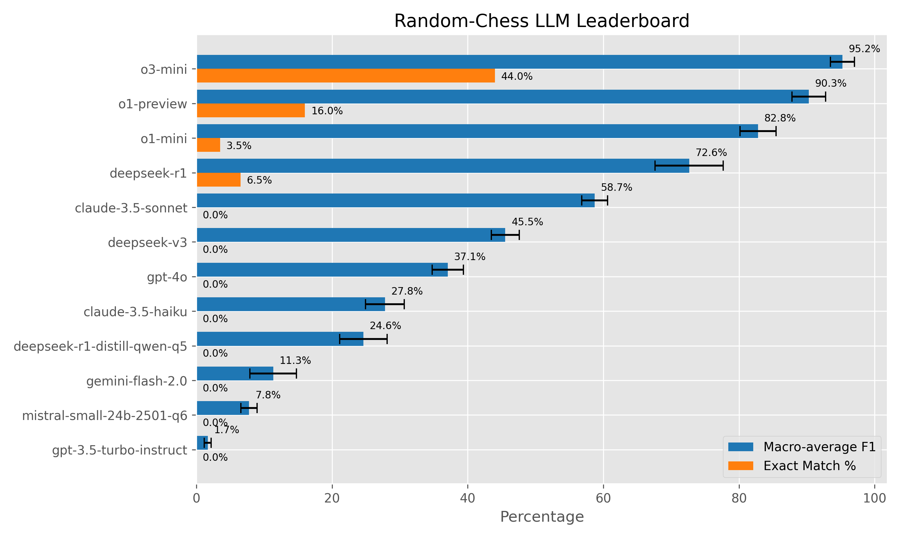
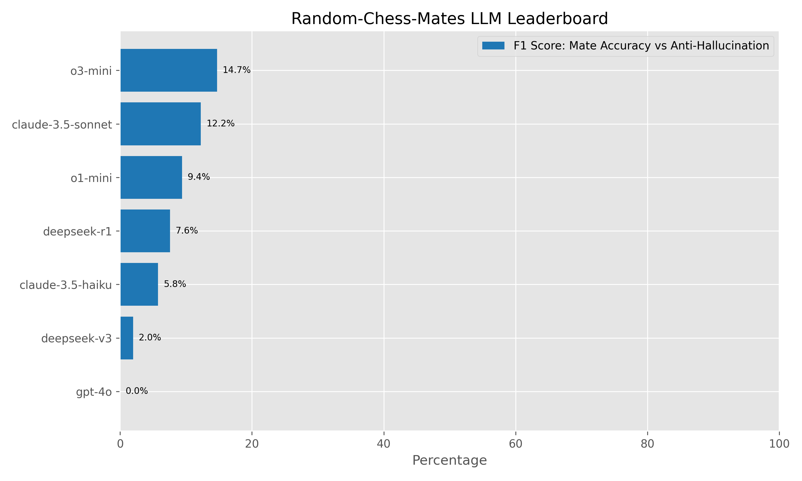

# Random-Chess: An LLM benchmark

Random-chess is a simple yet revealing benchmark, that requires an LLM to reason from its world knowledge of the chess rules and understanding of geometric relations between the squares on a grid, in order to calculate the valid moves for a chess position. This includes reasoning about kings being in check, pins, castling, and so on.

As the positions are randomly generated, memory based answers are not useful, and the training set cannot be picked up during training because it is generated on-the-fly.

There are currently 2 subtests:

1. **random-chess**, which tests the ability to find *all* legal moves in a position
2. **random-chess-mates**, which tests the ability to find *mate sequences*

## Key Features

- **Anti-Memorization Tests**: Generates unique positions on-the-fly through random play.
- **Tests Real Understanding and Reasoning**: Tests move generation in positions the LLM can never have seen before, requiring actual reasoning *or* a deeper understanding of the board geometry *in* the model.
- **Stochastic Benchmarking**: Prevents model gaming through unpredictable test sets (until someone embeds a chess engine in their API calls...), results are shown with confidence intervals.
- **Progress Display**: Streaming mode for real-time thinking observation, comprehensive logging for analysis.

## How It Works

### Random-Chess

1. **Position Generation**:
   - Creates 200 unique positions via random play with some piece weighting to ensure diverse positions.
   - Generates the legal moves through `python-chess`.

2. **LLM Evaluation**:
   - Presents FEN notation.
   - Requires UCI-format move lists with a specific prefix for the answer.
   - F1 score for matching the legal move list, additionally computing the amount of exact answers.

### Random-Chess-Mates

1. **Position Generation**:
    - Creates 100 unique positions through random play, where there is only a single move that gives mate-in-2.
    - Creates 100 unique positions through random play, where there is *no* mate-in-2.
    - Generates the legal moves through `python-chess`, checks suitability with Stockfish.

2. **LLM Evaluation**:
   - Presents FEN notation.
   - Requires a structured answer, saying there is no mate, or what the mating move is.
   - Calculates mate finding accuracy and the amount of mate hallucinations.

## Installation

```bash
pip install python-chess openai matplotlib

## Usage

# Minimum required arguments
python random-chess.py \
  --base-url "YOUR_API_URL" \
  --api-key "YOUR_API_KEY" \
  --model "MODEL_NAME"

# Full-featured example
python random-chess.py \
  --base-url "https://api.example.com/v1" \
  --api-key $LLM_API_KEY \
  --model "gpt-4o" \
  --results-log gpt-4o.results \
  --conversation-log gpt-4o.conversation \
  --concurrency 1 \
  --request-timeout 120 \
  --stream

# Environment Variables
export LLM_API_BASE_URL="your_api_url"
export LLM_API_KEY="your_api_key"
export LLM_MODEL="model_name"

# Generating score reports from logs
python score-runs.py --files results/*.results
python score-mate-runs.py --files results-mates/*.results

```

## Results

### Random-Chess

| Rank | Name                        | #Pos |    F1(%)         | Exact% |
|------|-----------------------------|------|------------------|--------|
|    1 | o3-mini (2025-01-31)        | 200  |  95.2% ±  1.8%   |  44.0% |
|    2 | o1-preview (2024-09-12)     | 200  |  90.3% ±  2.5%   |  16.0% |
|    3 | o1-mini (2024-09-12)        | 200  |  82.8% ±  2.6%   |   3.5% |
|    4 | deepseek-r1                 | 200  |  72.6% ±  5.0%   |   6.5% |
|    5 | claude-3.5-sonnet           | 200  |  58.7% ±  1.9%   |   0.0% |
|    6 | deepseek-v3                 | 200  |  45.5% ±  2.1%   |   0.0% |
|    7 | gpt-4o (2024-08-06)         | 200  |  37.1% ±  2.3%   |   0.0% |
|    8 | claude-3.5-haiku            | 200  |  27.8% ±  2.8%   |   0.0% |
|    9 | deepseek-r1-distill-qwen-q5 | 200  |  24.6% ±  3.5%   |   0.0% |
|   10 | gemini-flash-2.0            | 200  |  11.3% ±  3.4%   |   0.0% |
|   11 | mistral-small-24b-2501-q6   | 200  |   7.8% ±  1.2%   |   0.0% |
|   12 | gpt-3.5-turbo-instruct      | 200  |   1.7% ±  0.5%   |   0.0% |



### Random-Chess-Mates

| Rank | Name                     | #Pos  | MateAcc% | Halluc% |  F1(%) |
|------|--------------------------|-------|----------|---------|--------|
|  1   | o3-mini (2025-01-31)     |  200  |    12.0% |   81.0% |  14.7% |
|  2   | claude-3.5-sonnet        |  200  |     7.0% |   51.0% |  12.2% |
|  3   | o1-mini (2024-09-12)     |  200  |     5.0% |   24.0% |   9.4% |
|  4   | deepseek-r1              |  200  |     4.0% |   32.0% |   7.6% |
|  5   | claude-3.5-haiku         |  200  |     3.0% |   30.0% |   5.8% |
|  6   | deepseek-v3              |  200  |     1.0% |   25.0% |   2.0% |
|  7   | gpt-4o                   |  200  |     0.0% |   53.0% |   0.0% |



## Future

Current LLMs can not reliably determine the legal moves in a random chess position. If the state of the art advances enough that they are in the very high 90's exact matches, we can imagine extending the test with variations that require more reasoning. We added a first such test for mate-finding ability.

Specific training on chess can obviously make [very high performance transformers](https://lczero.org/dev/wiki/best-nets-for-lc0/) dedicated to chess. This test is aimed at seeing how general LLM can deal with the required reasoning.

## Notes

There are some prior publications that show that `GPT-3.5-Turbo-Instruct`, running in completion mode, [exhibits better chess performance than many newer models](https://dynomight.net/chess/). As is obvious in the results, this does not replicate here. We suspect the main reason is that the task is very different, and intentionally so: although in the above page the models are asked to play moves in "random positions never seen before", they are still very close to positions from regular game play, so memory based answers from similar positions are much more effective. In the above test, they did not actually have to play legal moves: *"I manually generated the set of legal moves and then used grammars to constrain the models...if it still couldn’t come up with a legal move, I just chose one randomly."*

Additionally, as the [author notes in a follow-up](https://dynomight.net/more-chess/), the GPT-3.5 model was trained on chess games in PGN notation, and the task was to complete a given PGN notation. This effect can be seen in our test: GPT-3.5 scores badly partly because it answers in short algebraic notation (which PGN uses), instead of the requested format. Essentially, GPT-3.5 is overfit to this task. In contrast, the model's performance on our test, requiring generalization to uncommon positions and being able to restate their knowledge in another format, much more closely follows their performance on other, general tasks.

## License

MIT License

Copyright (c) 2025 Héðinn Steingrímsson, Gian-Carlo Pascutto

Permission is hereby granted, free of charge, to any person obtaining a copy of this software and associated documentation files (the "Software"), to deal in the Software without restriction, including without limitation the rights to use, copy, modify, merge, publish, distribute, sublicense, and/or sell copies of the Software, and to permit persons to whom the Software is furnished to do so, subject to the following conditions:

The above copyright notice and this permission notice shall be included in all copies or substantial portions of the Software.

THE SOFTWARE IS PROVIDED "AS IS", WITHOUT WARRANTY OF ANY KIND, EXPRESS OR IMPLIED, INCLUDING BUT NOT LIMITED TO THE WARRANTIES OF MERCHANTABILITY, FITNESS FOR A PARTICULAR PURPOSE AND NONINFRINGEMENT. IN NO EVENT SHALL THE AUTHORS OR COPYRIGHT HOLDERS BE LIABLE FOR ANY CLAIM, DAMAGES OR OTHER LIABILITY, WHETHER IN AN ACTION OF CONTRACT, TORT OR OTHERWISE, ARISING FROM, OUT OF OR IN CONNECTION WITH THE SOFTWARE OR THE USE OR OTHER DEALINGS IN THE SOFTWARE.
